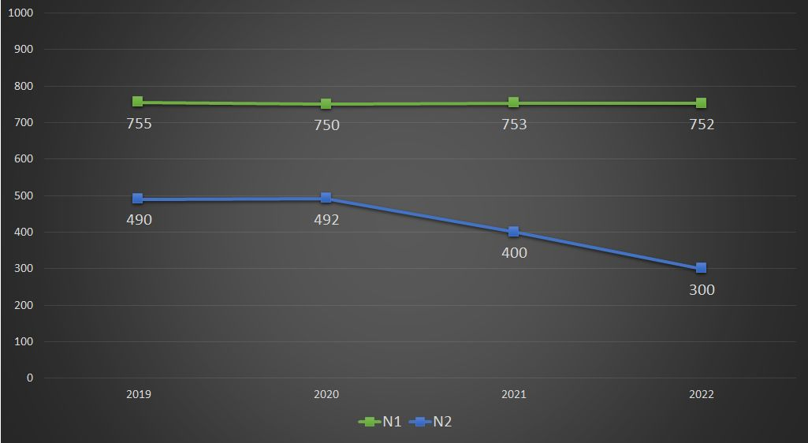
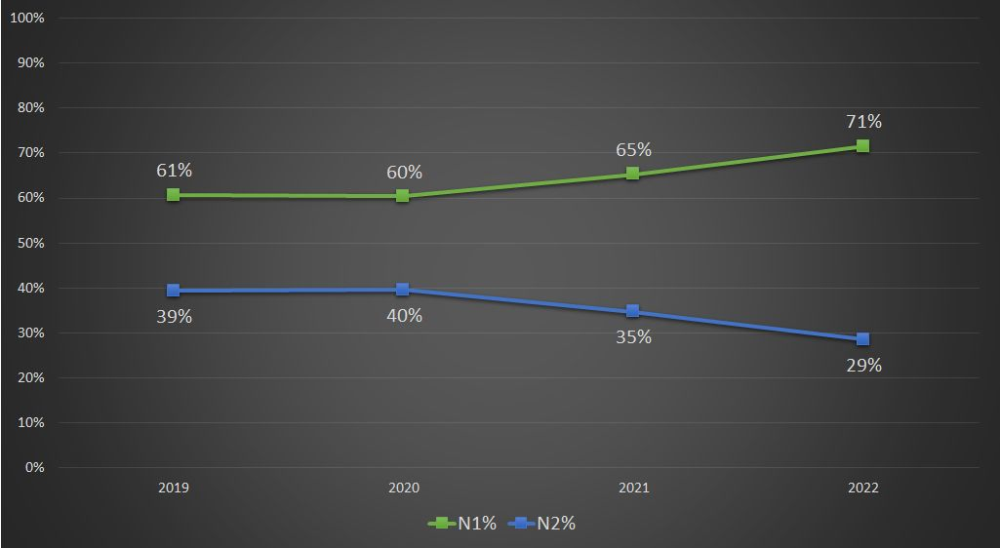

# LinkedIn posts of [Valerii Velicu](https://www.linkedin.com/in/valeriivelicu/)

## CASE statement within an aggregate function

```
Lately, there have been a lot of discussions on LinkedIn around the usage of a CASE statement within an aggregate function in SQL. Therefore I developed 2 queries:the first, on the left, incorporates CASE statements within the SUM aggregate function, while the second query on the right uses the PIVOT function. Both queries return the same results. 

If you have any inquiries regarding these queries, please feel free to include them in the comments section.

All of my LinkedIn posts are now available on GitHub accompanyied by the code. If you wish to practice with the queries I generate, visit my GitHub repository to easily access and copy-paste the code!

GitHub repo for Linkedin posts: https://github.com/velicu92/linkedin
```

``` sql
select																	|	with orders as (
    year(O_ORDERDATE)*100 + month(O_ORDERDATE) as month,				|	        select
    sum(case 															|	            year(O_ORDERDATE)*100 + month(O_ORDERDATE) as month,
			when C_MKTSEGMENT = 'MACHINERY' then O_TOTALPRICE end		|	            C_MKTSEGMENT,
		) as TotalPrice_Machinery,										|	            O_TOTALPRICE
    sum(case 															|	        from 
			when C_MKTSEGMENT = 'HOUSEHOLD' then O_TOTALPRICE end		|	            SNOWFLAKE_SAMPLE_DATA.TPCH_SF10.ORDERS
		) as TotalPrice_Household,										|	            left join SNOWFLAKE_SAMPLE_DATA.TPCH_SF10.CUSTOMER 
    sum(case 															|	                on O_CUSTKEY = C_CUSTKEY
			when C_MKTSEGMENT = 'FURNITURE' then O_TOTALPRICE end		|	    )
		) as TotalPrice_Furniture,										|	select
    sum(case 															|	    month,
			when C_MKTSEGMENT = 'AUTOMOBILE' then O_TOTALPRICE end		|	    MACHINERY as TotalPrice_Machinery,
		) as TotalPrice_Automobile,										|	    HOUSEHOLD as TotalPrice_Household, 
    sum(case 															|	    FURNITURE as TotalPrice_Furniture,
			when C_MKTSEGMENT = 'BUILDING' then O_TOTALPRICE end		|	    AUTOMOBILE as TotalPrice_Automobile,
		) as TotalPrice_Building										|	    BUILDING as TotalPrice_Building
from 																	|	from orders
    SNOWFLAKE_SAMPLE_DATA.TPCH_SF10.ORDERS								|	 pivot (
left join SNOWFLAKE_SAMPLE_DATA.TPCH_SF10.CUSTOMER 						|	     	sum(O_TOTALPRICE) for C_MKTSEGMENT in
    on O_CUSTKEY = C_CUSTKEY											|	           ('MACHINERY', 'HOUSEHOLD', 'FURNITURE', 'AUTOMOBILE', 'BUILDING') 
group by																|	     ) as p 
    month																|	         (month, MACHINERY, HOUSEHOLD, FURNITURE, AUTOMOBILE, BUILDING)
order by																|	order by
    month desc															|	    month desc
;																		|	;

			+--------+----------------------+----------------------+----------------------+-----------------------+---------------------+
			| MONTH  | TOTALPRICE_MACHINERY | TOTALPRICE_HOUSEHOLD | TOTALPRICE_FURNITURE | TOTALPRICE_AUTOMOBILE | TOTALPRICE_BUILDING |
			+========+======================+======================+======================+=======================+=====================+
			| 199808 |          373,350,652 |          357,335,049 |          390,405,781 |           392,962,443 |         380,163,937 |
			+--------+----------------------+----------------------+----------------------+-----------------------+---------------------+
			| 199807 |        5,847,275,516 |        5,818,291,457 |        5,818,531,761 |         5,884,202,961 |       5,829,242,284 |
			+--------+----------------------+----------------------+----------------------+-----------------------+---------------------+
			| 199806 |        5,642,666,964 |        5,617,937,709 |        5,631,863,066 |         5,645,174,546 |       5,641,098,695 |
			+--------+----------------------+----------------------+----------------------+-----------------------+---------------------+
			| 199805 |        5,802,386,053 |        5,860,799,075 |        5,879,834,204 |         5,860,150,480 |       5,801,791,105 |
			+--------+----------------------+----------------------+----------------------+-----------------------+---------------------+
			| 199804 |        5,611,115,419 |        5,649,424,467 |        5,657,488,454 |         5,627,255,472 |       5,661,253,106 |
			+--------+----------------------+----------------------+----------------------+-----------------------+---------------------+
			| 199803 |        5,914,917,777 |        5,806,480,031 |        5,829,725,810 |         5,837,754,880 |       5,815,274,864 |
			+--------+----------------------+----------------------+----------------------+-----------------------+---------------------+
			| 199802 |        5,260,211,768 |        5,319,751,326 |        5,269,450,508 |         5,253,071,258 |       5,293,720,331 |
			+--------+----------------------+----------------------+----------------------+-----------------------+---------------------+
			| 199801 |        5,853,491,165 |        5,832,398,020 |        5,819,542,588 |         5,821,122,286 |       5,847,482,213 |
			+--------+----------------------+----------------------+----------------------+-----------------------+---------------------+

```

## [There is no "Modern Data Stack"](https://www.linkedin.com/posts/valeriivelicu_dataengineering-dataanalytics-moderndatastack-activity-7163169958628192256-X6OY)

```
There is no "Modern Data Stack". 

There are tools that work and satisfy the needs of your business or your team. And there are tools that will never work for you! 

How do you know which tool is right and how to make a choice then? Through POC (Proof of concept).

While looking for the right data tool, create a POC beforehand by: 
✅ Defining your objectives;
✅ Identifying the key use cases;
✅ Implementing the most useful functionalities (always tailor these to your objectives and potential use cases);
✅ Gathering feedback from the team that will work with the tool in the future;
✅ Evaluating the final results. 

I oversimplified the steps above for clarity. When developing your proof of concept, it's crucial to tailor it to your specific requirements. There's no one-size-fits-all solution; each project is unique. Remember to adapt and customize your approach accordingly.

#dataengineering 
#dataanalytics 
#moderndatastack 
```

## [Turning off live database on weekends](https://www.linkedin.com/posts/valeriivelicu_datanalytics-jk-activity-7156718046743556096-qY4M)

```
Don't forget to turn off the production database when you log off work today! I'll se you on Monday!

#datanalytics
#jk
```

## [Data stack for personal projects](https://www.linkedin.com/posts/valeriivelicu_dataanalytics-moderndatastack-activity-7155591896344469504-dLXb)

```
Question to my fellow Data professionals: what's the best tech stack for a personal project? 

Let's flood the comment section with useful information for people that are looking to build their portfolio! (please justify your choice when possible)

#dataanalytics 
#moderndatastack 
```
## [Costs within a data team](https://www.linkedin.com/posts/valeriivelicu_datateam-costoptimization-dataanalytics-activity-7153763166106144769-Ldn0)

```
Do you want to reduce the costs within your data team further? 

Stop using data tools that charge you based on the number of active rows! You'll thank me later.

#datateam
#costoptimization 
#dataanalytics 
#dataengineering 
```

## [There are too many newsletters focused on data](https://www.linkedin.com/posts/valeriivelicu_i-only-read-2-of-them-theyre-written-activity-7153038220891410433-d_sX)

```
I only read 2 of them! 

They're written by:


Zach Wilson & Benjamin Rogojan

What do you read(or write)?
```


## [ZEROIFNULL and NULLIFZERO in Snowflake](https://www.linkedin.com/posts/valeriivelicu_snowflake-commandoftheweek-snowflake-activity-7152761295027490818-fxZo)

```
Happy Monday, everyone!

Let's continue the Snowflake learning, specifically focusing on numeric data types today. How often do you use COALESCE to fill in the NULL values in sql? Probably a lot! 

As most of the time we need to replace the NULL values with 0, #Snowflake has a built-in function just for this use case and it's called ZEROIFNULL().

There is also an option for the opposite operation, NULLIFZERO() for the situation when you want to have NULLs instead of zeros.

COALESCE may have a wider range of use cases but ZEROIFNULL() and NULLIFZERO() make your code more readable and easier to understand, have a look at the attached example!

#CommandOfTheWeek #Snowflake #sql #dataengineering
```
```sql
select 
        flight_number
    ,   flight_state
    ,   departure_country_code as departure_cc
    ,   arrival_country_code as  arrival_cc
    ,   actual_first_class_seats as seats_1st
    ,   actual_business_class_seats as seats_B
    ,   actual_premium_economy_class_seats as seats_PE
    ,   actual_economy_plus_class_seats as seats_EP
    ,   actual_economy_class_seats as seats_E
    ,   actual_first_class_seats 
            + actual_business_class_seats 
            + actual_premium_economy_class_seats 
            + actual_economy_plus_class_seats 
            + actual_economy_class_seats 
                as total_seats
    ,   ZEROIFNULL(actual_first_class_seats) 
            + ZEROIFNULL(actual_business_class_seats) 
            + ZEROIFNULL(actual_premium_economy_class_seats)
            + ZEROIFNULL(actual_economy_plus_class_seats) 
            + ZEROIFNULL(actual_economy_class_seats) 
                as total_seats_correct
from 
    FlightStatus.PUBLIC.FLIGHT_STATUS_NULL_DATASET
where 1=1
    and flight_state = 'Landed'
;
```

## [2023 takeaways](https://www.linkedin.com/posts/valeriivelicu_sql-snowflake-databricks-activity-7148682003855335426-XkIS)

```
What is your main takeaway from 2023? 

Mine is about data tools. Throughout my career I worked with many data tools, every time I switched jobs - I switched the tools too. Ultimately, I learned that my knowledge, educational background and business acumen are more important than the tools I work with, which is also proven to be true by many data professionals I personally know. 

However, in 2023 I learned that there are 10% of real life situations when the tools matter, a lot. This past year taught me to be flexible regarding everything in the data analytics world. 

As a conclusion, always focus on knowledge but don't forget about the tools! In other words, learn #sql first and then #snowflake, #databricks, #gcp, #dbt, etc.

#dataengineering #dataanalytics
```

## [LIKE and ILIKE commands](https://www.linkedin.com/posts/valeriivelicu_sql-dataanalytics-dataengineering-activity-7141557041763942400-69AF)

```
In my ongoing series on handling string columns in #sql, today we're looking at LIKE and ILIKE commands. Do you know the differences? 

- LIKE helps you to match a pattern but it is case sensitive and this can be a huge disadvantage while your strings are long or contain many words;

- ILIKE works exactly the same as LIKE, but it is case-insensitive and it is useful when working with complicated string values. It can also be used effectively when working with messy data, we all know that 'florida' is not same as 'Florida' in many of the data systems.

Recently, I've been relying more on ILIKE due to the increased flexibility it provides.

#DataAnalytics #DataEngineering #Snowflake #CommandOfTheWeek
```
```sql
select
    name,
    founded,
    country,
    industry,
    size
from companydataset
where 1=1
    and founded >= 2010
    and country like '%USA%'
    and industry = 'banking'
;

select 
    name,
    founded,
    country,
    industry,
    size
from companydataset
where 1=1
    and founded >= 2010
    and country ilike '%usa%'
    and industry = 'banking'
;
```

## [SQL - a cross-platform language](https://www.linkedin.com/posts/valeriivelicu_sql-dataanalytics-dataengineering-activity-7140440357627965440-Bman)

```
The beautiful thing about #SQL is being the same across all platforms and yet, it is so different at the same! 

#DataAnalytics #DataEngineering 
```

## [The lack of basic statistical concepts among data professionals](https://www.linkedin.com/posts/valeriivelicu_statistics-dataanalytics-average-activity-7138573788597686272-VuHY)

```
The lack of basic statistical concepts among data professionals makes the "average" the most used statistical metric in the world. 

#statistics #dataanalytics #average #dataprofessionals 
```

## ["1=1" Usage poll - Results](https://www.linkedin.com/posts/valeriivelicu_sql-dataanalytics-datavisualization-activity-7137903230092541954-3nC_)

```
Who likes pie charts? 

About one week ago I created a poll asking who is using "1=1" when writing #sql queries (Link to the poll: https://lnkd.in/gRqBdTKy). And the results are in the pie chart below. 

Is it correct to assume that 59% of people who write SQL use "1=1" in their queries? What's wrong with this statement, how should we look at the results of this poll? Ultimately, as data professionals we should always question the data integrity.

Data visualization people, what would you do differently in this pie chart and why? 

#dataanalytics #datavisualization
```

## [SPLIT and SPLIT_PART in Snowflake](https://www.linkedin.com/posts/valeriivelicu_sql-dataanalytics-snowflake-activity-7137522426564792320-5M94)

```
Happy Monday everyone!

Following my last week's post about working with string data in Snowflake, below are two additional SQL commands that will help you transform the data. (See the post here: https://lnkd.in/gjha-yjn) 

- SPLIT: As the names suggests this command will split the data by the given separator and will return the values in an array of strings;

- SPLIT_PART: derived from split, works similarly but this time you can specify which part of the array to return.

What other sql commands have you used while handling string data? 

#sql #dataanalytics #snowflake 
```
```sql
select
    id,
    linkedin_url,
    split(linkedin_url, '/') as linkedin_url_split,
    split_part(linkedin_url, '/', 2) as site_type,
    split_part(linkedin_url, '/', 3) as  name_split_part
from companydataset
;
```

## [Stop reporting wrong data](https://www.linkedin.com/posts/valeriivelicu_dataanalytics-datavisualization-statistics-activity-7136380719114686465-dUSt)

```
Stop reporting the wrong data!

Ask yourself this simple question "Does this make sense?" before you create a great looking chart or a nicely formatted table to show the end users some stats. You should always report the data that makes sense, otherwise poor decisions can be made. 

Look at the example below, if you look at the first chart - is it okay to say that N1 grew over time? Probably yes but it does not make sense because you chose to show the percentages in the chart. 
If you look at the absolute values from the second chart you will see that exactly the opposite is happening - N2 decreased over time while N1 is almost constant throughout the years. 

This created a biased view of the data, so ensure you select appropriate metrics and present the data in the correct format.

#dataanalytics #datavisualization #statistics 
```




## [STRTOK & STRTOK_TO_ARRAY in Snowflake](https://www.linkedin.com/posts/valeriivelicu_sql-snowflake-dataengineering-activity-7135300729233145858-CjiY)


```
How often do you find yourself working with string columns in SQL? 

If your string data is delimited - Snowflake has a few great commands that can tokenize the values and return the requested part of the string. 

Here is how some of them work: 

- STRTOK: Given a delimiter the command returns the specified part. A good thing to remember here is that the token order starts at 1, you can see how it works in the example below. 

- STRTOK_TO_ARRAY: This command, when given a delimiter, transforms your string into an array. It's worth to remember that in this case the token order starts at 0. You can also extract a specific array element by specifying the token position, similar to how you would do it in languages like Python.

Do you know any useful SQL commands that can be useful when working with string columns? Feel free to share them in the comments!

#SQL #Snowflake #DataEngineering #dataanalytics #CommandOfTheWeek
```
```sql
select
    id,
    linkedin_url,
    STRTOK(linkedin_url, '/', 1) as site,
    STRTOK(linkedin_url, '/', 2) as site_type,
    STRTOK(linkedin_url, '/', 3) as name,
    STRTOK_TO_ARRAY(linkedin_url, '/') as url_as_array,
    STRTOK_TO_ARRAY(linkedin_url, '/')[2] as name_from_array
from companydataset
;
```

## ["1=1" Usage poll](https://www.linkedin.com/posts/valeriivelicu_sql-dataengineering-dataanalytics-activity-7133505614655225857-n8s5)

```
Have you ever used "1=1" in your SQL queries? Let's discuss the benefits and drawbacks of this approach, an example is provided in the comments.

#SQL #dataengineering #dataanalytics 
```

## [Never use UPDATE command in SQL](https://www.linkedin.com/posts/valeriivelicu_commandoftheweek-sql-dataengineering-activity-7132744515009843202-c9lm)

```
Never use UPDATE in SQL!

UPDATE is a powerful SQL command with immediate consequences on your data. You should avoid using it as much as possible and never use it in production databases. 

Here are a few key points you should be aware of, before using an UPDATE: 

◾ An UPDATE cannot be rolled back, once you run it and the command succeeds - your data has been changed forever;
◾ You can't trace the changes in data and you won't able to validate the initial state of the data after an update;
◾ Consider the performance - UPDATE commands take longer to execute compared to any other SQL command. From my experience it is dozens of times slower;
◾ Pay attention to "WHERE" clause, make sure to check the conditions multiple times. If you accidentally run a wrong UPDATE it will lead to permanent data transformations without any way to recover.

What's your experience with the UPDATE command in SQL?

#CommandOfTheWeek #sql #DataEngineering #Snowflake
```
```sql
update companydataset
set region = 'california'
where industry = 'banking'
    and locality = 'san diego'
    and country = 'US'
;
```

## [OpenAI drama](https://www.linkedin.com/posts/valeriivelicu_openai-chatgpt-samaltman-activity-7131782554151514112-19AT)

```
In order to take advantage of the LinkedIn algorithm over the weekend I decided to write a post about OpenAI.
.
.
.
.
.
That's it. Thank you and follow for more!

#openai #chatgpt #samaltman 
```

## [EXCLUDE command in Snowflake](https://www.linkedin.com/posts/valeriivelicu_commandoftheweek-activity-7131327926695854081-CICC)

```
#CommandOfTheWeek

Were you aware that in Snowflake, you have the ability to EXCLUDE a column from the SELECT statement? Here's how it works: You can employ "SELECT *" and specify one or more columns for exclusion by using "SELECT * EXCLUDE COLUMN_NAME FROM TABLE".

Although there might not be many instances where this feature is applicable in practical scenarios, it can prove to be exceptionally useful when needed.

One practical application is in reporting, where you can introduce a custom sorting column, use it for ordering the table, and yet not displaying it in the final output for users:

SELECT * EXCLUDE ROW_NUMBER FROM TABLE ORDER BY ROW_NUMBER;

Have you come across a similar command in the tools you're currently using? Comment below!
```
```sql
select * from companydataset;

select * exclude(website, size) from companydataset;
```

## [Stop using SELECT DISTINCT](https://www.linkedin.com/posts/valeriivelicu_sql-snowflake-dataengineering-activity-7130192703803297792-QKBh)

```
Stop using SELECT DISTINCT!

Recently I came across an online discussion where many data professionals mentioned employing SELECT DISTINCT in their data pipeline to de-duplicate the rows and not cause disruptions.

Even if the final results is correct, it's not always advisable to deduplicate data by using this method. Instead of assuming and adding DISTINCT into your queries, establish some tests. These tests should identify duplicated rows, trigger alerts and perhaps stop the processing. 

Understanding the structure of your data at the source is crucial. There are many cases where duplicated data aligns with business perspectives. 

Moreover, the use of DISTINCT can significantly prolong query execution times. In the example below you can see an increase of 60% in running time by using DISTINCT on a small table containing only 22.9M rows and 10 columns. Imagine the impact on a larger table!

#sql #Snowflake #dataengineering 
```
```sql
select
    COUNTRY,
    FOUNDED,
    ID,
    INDUSTRY,
    LINKEDIN_URL,
    LOCALITY,
    NAME,
    REGION,
    SIZE,
    WEBSITE
from companydataset
;

select distinct
    COUNTRY,
    FOUNDED,
    ID,
    INDUSTRY,
    LINKEDIN_URL,
    LOCALITY,
    NAME,
    REGION,
    SIZE,
    WEBSITE
from companydataset
;

select
    query_text,
    warehouse_type,
    execution_status,
    compilation_time/1000 + execution_time/1000 as execution_time_in_sec,
    rows_produced
from snowflake.account_usage.query_history
where 1=1
    and query_id in ('01b04fcf-3200-f482-0000-00047cfe3239',
                     '01b04fcf-3200-f48a-0000-00047cfe22c5')
order by
    end_time desc
;
```

## [UNDROP command in Snowflake](https://www.linkedin.com/posts/valeriivelicu_snowflake-sql-dataengineering-activity-7127709027588837376-LU9a)

```
Did you know that you can UNDROP an object in Snowflake? 

Time Travel functionality of Snowflake gives you the possibility to restore certain objects that were intentionally or unintentionally deleted (such as databases, schemas, tables, tags or accounts). 

The retention period of 24 hours is included as a standard for all Snowflake accounts, but you can go back in time as much as 90 days if you have an Enterprise edition account. 

You don't have to worry about accidental deletion if you are using Snowflake. Of course this does not mean you can delete the production database whenever you want as it takes time to restore deleted data objects.

Read more about UNDROP here: https://lnkd.in/gTHbd3TG

#Snowflake #sql #dataengineering 
```

## [UNION vs UNION ALL in SQL](https://www.linkedin.com/posts/valeriivelicu_sql-snowflake-dataengineering-activity-7125572207988133888-qNeL)

```
Inspired by a post made by Adrian-Constantin Duta about UNION vs UNION ALL, I decided to highlight a very specific detail when working with these 2 SQL commands.

Take a look at the case number 1 below. Table 1 and 2 contain 5 values each, from 1 to 5. When using a "where" command it will only be applied to the second table in the UNION and if you have more than 2 tables in your UNION it will only apply to the last table in the UNION.

How we get that fixed? First make sure you have your UNION separately, you can use a CTE or insert the results of the UNION in a table. Ultimately, add the "where" command so it works for the entire dataset, see the case number 2 below.

Case number 3 shows the difference between "where" and "order by" commands. While "where" works only on the last table from the UNION, order by works perfectly for the entire dataset after UNION is executed.

#sql #Snowflake #dataengineering
```

```sql
-- Case 1
select col_name from table_1

UNION ALL -- or UNION

select col_name from table_2
where 
    col_name < 5
;

-- Case 2
with union_table as 
    (
        select col_name from table_1

        UNION ALL -- or UNION

        select col_name from table_2
    )
select col_name from union_table
where
    col_name < 5
;

--- Case 3
select col_name from table_1

UNION ALL -- or UNION

select col_name from table_2
where
    col_name < 5
order_by
    col_name
;
```
## [Excel - the most used data tool](https://www.linkedin.com/posts/valeriivelicu_excel-activity-7124825590993481728-EdRs)

```
In my last post I talked about cloud technologies, but let's take a step back. #Excel remains the most used tool within Data Analytics world. Don't underestimate its enduring value, you have to use it every day!
```

## [Cloud technologies](https://www.linkedin.com/posts/valeriivelicu_whats-the-deal-with-cloud-technologies-activity-7123734683669983233-rUGH)

```
What's the deal with cloud technologies? They provide a range of services and resources, including storage, databases, networking, and analytics tools, all accessible from anywhere in the world. 

These technologies enable seamless data processing, storage, and analysis, providing businesses with unparalleled scalability, flexibility, and cost-efficiency.

Check out this article about cloud computing which provides some statistics about the rise of these technologies over the past years: 

https://lnkd.in/gr3QZCpB
```

## [My first LinkedIn post - Hello World!](https://www.linkedin.com/posts/valeriivelicu_snowflake-dataanalytics-snowflake-activity-7122929797034323969-tHOd)

```
In today's dynamic landscape, data analytics fuels informed decision-making. Having worked extensively with #Snowflake, I've seen its transformative potential in simplifying data management and accelerating analytics. 

I'm happy to announce that I will start sharing experiences, strategies, and insights, hoping to spark discussions on data analytics, Snowflake, and the wider data ecosystem. Let's connect and feel free to join future posts!🔥

#DataAnalytics #Snowflake #TechInnovation
```
